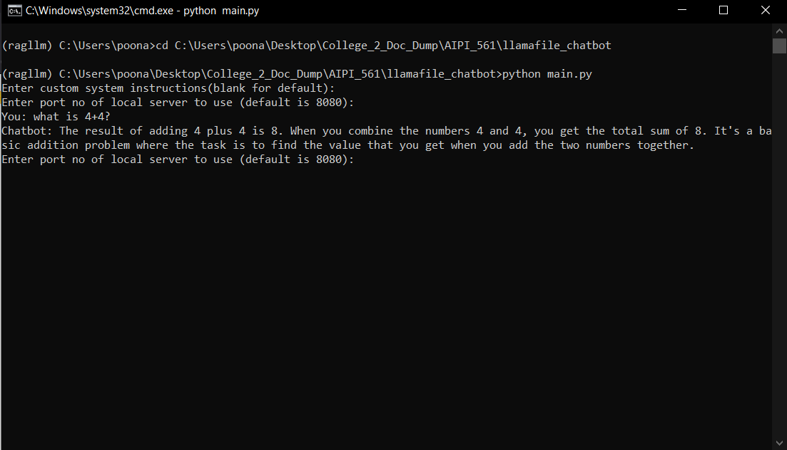
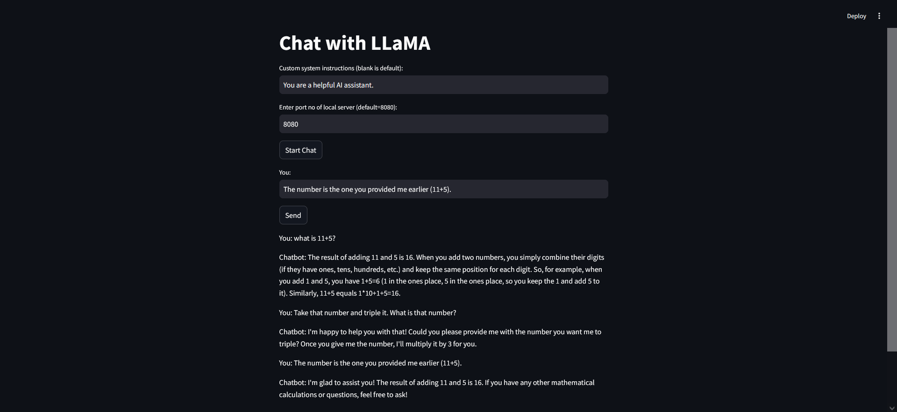

# Ultra-Lightweight Llamafile Chatbot 

## CI/CD Badge:
[![CI/CD]](https://github.com/Aryan-Poonacha/llamafile_chatbot/actions)

## Demo Video:
[](LINK_TO_YOUR_DEMO_VIDEO)

## Project Purpose

This is a minimal chatbot application with all parameters, model selection, and relevant application decisions tuned such that that a tinyllama `llamafile` model can be used to create a simple conversational agent that can be deployed in low compute, low-power edge computing cases. This project would be ideal for deployment on a Raspberry Pi or Arduino use case. A Dockerized container deployment is provided to create the most lightweight docker container for the model.

## Architecture

This project utilizes a simple architecture:

- **`main.py`:** Contains the core logic to run the chatbot, interacting with the llamafile model and the local server that it deploys.
- **`llamafile/TinyLlama-1.1B-Chat-v1.0.F16.llamafile`:** (Not included in the repository) The pre-trained language model used by the chatbot. Run within the WSL container on Windows.
-**app.py**: The script for the streamlit frontend interface to interact.
- **Docker:** The application is packaged into a Docker container for easy deployment.

### Architecture Diagram

## Setup and Running

1. **Prerequisites:**
   - Install [Docker](https://docs.docker.com/get-docker/).
   - Download the `TinyLlama-1.1B-Chat-v1.0.F16.llamafile` model from [https://github.com/Mozilla-Ocho/llamafile#other-example-llamafiles](https://github.com/Mozilla-Ocho/llamafile#other-example-llamafiles) and place it in the root of the project directory inside the 'llamafile' folder.

2. **Launch TinyLlama Local Server:**
   - On Mac/Linux, provide permission to launch the llamafile with `chmod +x TinyLlama-1.1B-Chat-v1.0.F16.llamafile`. Then, navigate to the directory and run the file with `./llava-v1.5-7b-q4.llamafile`. This will launch the locallama server.

   - On Windows, you will need to setup WSL and get to the stage of having a WSL terminal active. Then, follow the above steps. Alternatively, you can follow the steps provided (here)[https://github.com/Mozilla-Ocho/llamafile] to launch it from a normal windows CMD prompt.

   - **Model Selection** - Under the llamafile folder, you can place multiple llamafile to support different models. For each one, you can follow the steps above to launch a separate local server instance for each model. By default, they will be initialized to ports in increments of 1 from 8080 (so model 1 will be at 8080, model 2 will be at 8081, etc.)

3. **Interact Locally via CLI:**
   - Navigate to the project directory in your terminal.
   - Run `python main.py`.
   - Start chatting!



2. **Interact Locally via web interface:**

The project also includes a web interface created using streamlit to keep track of a conversation with chat history to have a conversation with the model. To run it:
   - Navigate to the project directory in your terminal.
   - Run `streamlit run app.py`.
   - The streamlit interface will launch in your default browser.
   - Start chatting!



3. **Run with Docker:**
   - Build the image: `docker build -t my-chatbot .`
   - Run the container (replace `MODEL_PATH` with the correct path within the container, if necessary): 
      ```bash
      docker run -it --rm \
        -v $(pwd)/TinyLlama-1.1B-Chat-v1.0.F16.llamafile:/app/TinyLlama-1.1B-Chat-v1.0.F16.llamafile  \ 
        my-chatbot 
      ```

## Testing

Run unit tests: `python -m unittest test_main.py`

The unit tests are also part of the CI/CD pipeline and run automatically on every push.

## Examples

**Input:** Write a fibonacci sequence function.
**Output:**

```
`def fibonacci(n):
    """
    Returns the nth Fibonacci number.
    """
    if n < 2:
        return n
    else:
        return fibonacci(n-1) + fibonacci(n-2)
```
Here's how you can use it:
python
>>> fibonacci(10)

## Performance/Evaluation 

(Add any performance observations or benchmarks here. For a simple project like this, focus on qualitative aspects like response time and coherence).

## CI/CD Pipeline Github Actions

Things included are:

* `Makefile`

* `Pytest`

* `pandas`

* `Ruff`:  

Run `make lint` which runs `ruff check`.  You can find out more info on [Ruff here](https://github.com/astral-sh/ruff).

* `Dockerfile`

* `GitHub copilot`

* `jupyter` and `ipython` 

## Future Improvements

- Implement a more sophisticated chatbot interface (web UI, command-line arguments).
- Incorporate error handling and edge-case management.
- Explore more advanced functionalities of the `llamafile` model.

## References

Gospel:


